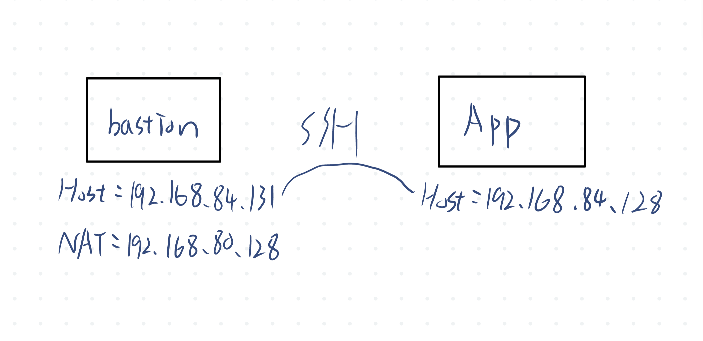
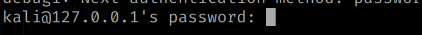
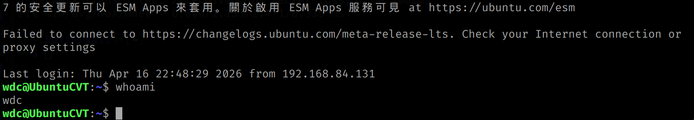

# 期中實作 — 411630337 翁濬緯

## 1. 架構與 IP 表


## 2. Part A：VM 與網路
<命令 + 關鍵輸出>
bastion ping app
```
──(kali㉿kali)-[~]
└─$ ping -c 2 192.168.84.128
PING 192.168.84.128 (192.168.84.128) 56(84) bytes of data.
64 bytes from 192.168.84.128: icmp_seq=1 ttl=64 time=1.47 ms
64 bytes from 192.168.84.128: icmp_seq=2 ttl=64 time=0.800 ms

--- 192.168.84.128 ping statistics ---
2 packets transmitted, 2 received, 0% packet loss, time 1002ms
rtt min/avg/max/mdev = 0.800/1.135/1.471/0.335 ms

```

App ping bastion
```
wdc@UbuntuCVT:~$ ping -c 2 192.168.84.131
PING 192.168.84.131 (192.168.84.131) 56(84) bytes of data.
64 bytes from 192.168.84.131: icmp_seq=1 ttl=64 time=3.81 ms
64 bytes from 192.168.84.131: icmp_seq=2 ttl=64 time=0.558 ms

--- 192.168.84.131 ping statistics ---
2 packets transmitted, 2 received, 0% packet loss, time 1002ms
rtt min/avg/max/mdev = 0.558/2.184/3.811/1.626 ms
```

## 3. Part B：金鑰、ufw、ProxyJump
<防火牆規則表 + ssh app 成功證據>
用 cat ~/.ssh/authorized_keys 看App有沒有金鑰
```
ssh-ed25519 AAAAC3NzaC1lZDI1NTE5AAAAIKeRnPn1fPQC3TgLUcKF3xpS/SVPCUnFxPfe65d5zd1f bastion-key
```
在bastion上用ssh wdc@192.168.84.128 "hostname"看能不能用金鑰登入
```
UbuntuCVT
```
關閉密碼登入  
防火牆規則表:
```
bastion:
To                         Action      From
--                         ------      ----
5901/tcp                   ALLOW       Anywhere                  
7000                       ALLOW       Anywhere                  
80/tcp                     ALLOW       Anywhere                  
8000                       ALLOW       Anywhere                  
Anywhere                   ALLOW       192.168.84.0/24           
22/tcp                     ALLOW       Anywhere                  
5901/tcp (v6)              ALLOW       Anywhere (v6)             
7000 (v6)                  ALLOW       Anywhere (v6)             
80/tcp (v6)                ALLOW       Anywhere (v6)             
8000 (v6)                  ALLOW       Anywhere (v6)             
22/tcp (v6)                ALLOW       Anywhere (v6) 

App:
至                          動作          來自
-                          --          --
22/tcp                     ALLOW       192.168.84.0/24           
22/tcp                     ALLOW       192.168.84.131 
```

用kali先到自己再去App，只需要輸入kali密碼後就能用ssh金鑰直接進入App



## 4. Part C：Docker 服務
<systemctl status docker + curl 輸出>
```
 docker.service - Docker Application Container Engine
     Loaded: loaded (/usr/lib/systemd/system/docker.service; enabled; preset: enabled)
     Active: active (running) since Thu 2026-04-16 21:33:49 CST; 1h 19min ago
TriggeredBy: ● docker.socket
       Docs: https://docs.docker.com
   Main PID: 1795 (dockerd)
      Tasks: 12
     Memory: 133.3M (peak: 135.3M)
        CPU: 1.587s
     CGroup: /system.slice/docker.service
             └─1795 /usr/bin/dockerd -H fd:// --containerd=/run/containerd/containerd.sock

```

```
┌──(kali㉿kali)-[~]
└─$ curl -I http://192.168.84.128:8080   
HTTP/1.1 200 OK
Server: nginx/1.29.8
Date: Thu, 16 Apr 2026 14:54:57 GMT
Content-Type: text/html
Content-Length: 896
Last-Modified: Tue, 07 Apr 2026 11:37:12 GMT
Connection: keep-alive
ETag: "69d4ec68-380"
Accept-Ranges: bytes
```
如果從bastion http網站連不上可以設定ufw的防火牆，可以用
```
sudo ufw allow from 192.168.84.131 to any port 8080 proto tcp
```
加入規則
## 5. Part D：故障演練
### 故障 1：F2
- 注入方式：
```
sudo ufw reset
sudo ufw default deny incoming
sudo ufw default deny outgoing  
sudo ufw enable
sudo ufw status verbose
```

- 故障前：
```
┌──(kali㉿kali)-[~]
└─$ ssh wdc@192.168.84.128 "hostname"
UbuntuCVT
```

- 故障中：
```
ssh: connect to host 192.168.84.128 port 22: Connection timed out
```

- 回復後：
```
┌──(kali㉿kali)-[~]
└─$ ssh wdc@192.168.84.128 "hostname"
UbuntuCVT
```

- 診斷推論：ping的通，但是ssh連線會timeout(也可檢查有無在聽)，可以看ufw有沒有允許需要的規則

### 故障 2：<另一個>
（同上）
- 注入方式：
```
sudo systemctl stop docker.socket
sudo systemctl stop docker.service
systemctl status docker docker.socket --no-pager
```

- 故障前：
```
確認有開且可以連上服務
● docker.service - Docker Application Container Engine
     Loaded: loaded (/usr/lib/systemd/system/docker.service; enabled; preset: enabled)
     Active: active (running) since Thu 2026-04-16 21:33:49 CST; 2h 7min ago
TriggeredBy: ● docker.socket
       Docs: https://docs.docker.com
   Main PID: 1795 (dockerd)
      Tasks: 28

┌──(kali㉿kali)-[~]
└─$ curl -I http://192.168.84.128:8080       
HTTP/1.1 200 OK
Server: nginx/1.29.8
Date: Thu, 16 Apr 2026 15:42:36 GMT
Content-Type: text/html
Content-Length: 896
Last-Modified: Tue, 07 Apr 2026 11:37:12 GMT
Connection: keep-alive
ETag: "69d4ec68-380"
Accept-Ranges: bytes
```

- 故障中：
```
ssh還可以連上，但是網站連不上
┌──(kali㉿kali)-[~]
└─$ curl -I http://192.168.84.128:8080
curl: (28) Failed to connect to 192.168.84.128 port 8080 after 129739 ms: Could not connect to server

wdc@UbuntuCVT:~$ docker ps
Cannot connect to the Docker daemon at unix:///var/run/docker.sock. Is the docker daemon running?
```

- 回復後：
```
● docker.service - Docker Application Container Engine
     Loaded: loaded (/usr/lib/systemd/system/docker.service; enabled; preset: enabled)
     Active: active (running) since Thu 2026-04-16 23:53:32 CST; 10ms ago
TriggeredBy: ● docker.socket
       Docs: https://docs.docker.com
   Main PID: 6762 (dockerd)
      Tasks: 12
     Memory: 25.8M (peak: 28.5M)
        CPU: 558ms
     CGroup: /system.slice/docker.service
             └─6762 /usr/bin/dockerd -H fd:// --containerd=/run/containerd/containerd.sock
```

- 診斷推論：看能不能SSH連線，再看服務有沒有連，再去檢查docker ps輸出(docker status也要看一下)

### 症狀辨識（若選 F1+F2 必答）
兩個都 timeout，我怎麼分？

## 6. 反思（200 字）
做F2從bastion看起來是timeout，但ping是正常的，代表L3層沒問題；到app用ufw status規則看22能不能被放行，如果可以就能把問題轉到防火牆上。F3則相反，SSH仍可正常連線但是網站連不上，docker ps 出現Cannot connect，表示是服務Docker daemon故障。但是docker.service 仍有可能被docker.socket觸發，所以要連socket一起停才會出現cannot connect。要使用一層一層的方式去診斷問題，並且要有驗證，解決問題後還是要驗證是否正常。

## 7. Bonus（選做）