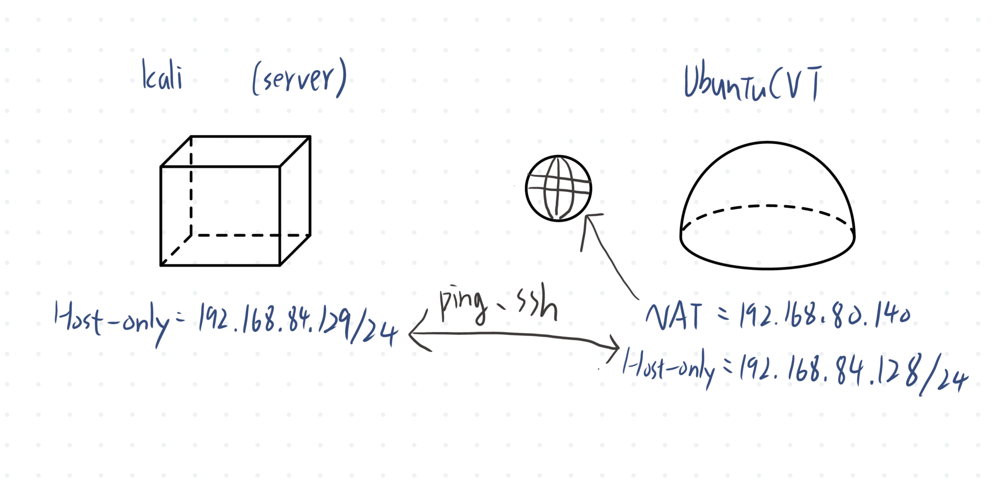

# W02｜VMware 網路模式與雙 VM 排錯

## 網路配置

| VM | 網卡 | 模式 | IP | 用途 |
|---|---|---|---|---|
| UbuntuCVT | NIC 1 | NAT | 192.168.80.140 | 上網 |
| Ubuntucvt | NIC 2 | Host-only | 192.168.84.128 | 內網互連 |
| Kali| NIC 1 | Host-only | 192.168.84.129 | 內網互連 |

## NAT / Bridged / Host-only 三種模式的差異摘要
NAT透過主機來上網，但是外部不能連進虛擬機裡；Bridged等於是另一台新的機器與網路連線，可以拿到一個與主機同段的IP，外部設備可以連入；Host-only則是只有主機內部可以互相溝通，無法連外，外部也無法連入


## 為什麼本週採用 NAT + Host-only 雙網卡設計的理由
雙網卡設計可以讓連外使用NAT，對內使用Hoat-only，做出分工，如果只使用NAT可能會造成在排錯時讓問題更複雜

## 連線驗證紀錄

- [ ] dev-a NAT 可上網：`ping google.com` 輸出
```
PING google.com (142.250.198.78) 56(84) bytes of data.
64 bytes from lctsaa-ab-in-f14.1e100.net (142.250.198.78): icmp_seq=1 ttl=128 time=28.1 ms
64 bytes from lctsaa-ab-in-f14.1e100.net (142.250.198.78): icmp_seq=2 ttl=128 time=14.3 ms
64 bytes from lctsaa-ab-in-f14.1e100.net (142.250.198.78): icmp_seq=3 ttl=128 time=14.1 ms
64 bytes from lctsaa-ab-in-f14.1e100.net (142.250.198.78): icmp_seq=4 ttl=128 time=15.6 ms
```

- [ ] 雙向互 ping 成功：貼上雙方 `ping` 輸出
```
PING 192.168.84.129 (192.168.84.129) 56(84) bytes of data.
64 bytes from 192.168.84.129: icmp_seq=1 ttl=64 time=2.48 ms
64 bytes from 192.168.84.129: icmp_seq=2 ttl=64 time=0.547 ms
64 bytes from 192.168.84.129: icmp_seq=3 ttl=64 time=0.429 ms
64 bytes from 192.168.84.129: icmp_seq=4 ttl=64 time=0.856 ms
--- 192.168.84.129 ping statistics ---
4 packets transmitted, 4 received, 0% packet loss, time 3082ms
rtt min/avg/max/mdev = 0.429/1.077/2.477/0.823 ms

PING 192.168.84.128 (192.168.84.128) 56(84) bytes of data.
64 bytes from 192.168.84.128: icmp_seq=1 ttl=64 time=1.48 ms
64 bytes from 192.168.84.128: icmp_seq=2 ttl=64 time=0.472 ms
64 bytes from 192.168.84.128: icmp_seq=3 ttl=64 time=0.472 ms
64 bytes from 192.168.84.128: icmp_seq=4 ttl=64 time=0.514 ms
64 bytes from 192.168.84.128: icmp_seq=5 ttl=64 time=1.87 ms
--- 192.168.84.128 ping statistics ---
5 packets transmitted, 5 received, 0% packet loss, time 4058ms
rtt min/avg/max/mdev = 0.472/0.961/1.871/0.595 ms
```

- [ ] SSH 連線成功：`ssh <user>@<ip> "hostname"` 輸出
```
wdc@UbuntuCVT:~$ ssh kali@192.168.84.129 "hostname"
kali@192.168.84.129's password: 
kali
```

- [ ] SCP 傳檔成功：`cat /tmp/test-from-dev.txt` 在 server-b 上的輸出
```
wdc@UbuntuCVT:~$ ssh kali@192.168.84.129 "cat /tmp/test-from-dev.txt"
kali@192.168.84.129's password: 
Hello from dev-a
```

- [ ] server-b 不能上網：`ping 8.8.8.8` 失敗輸出
```
┌──(kali㉿kali)-[~]
└─$ ping -c 5 8.8.8.8       
ping: connect: 無法接觸網路
```

## 故障演練一：介面停用

| 項目 | 故障前 | 故障中 | 回復後 |
|---|---|---|---|
| server-b 介面狀態 | UP | DOWN | UP |
| dev-a ping server-b | 成功 | 失敗 | 4 packets transmitted, 4 received, 0% packet loss, time 3090ms |
| dev-a SSH server-b | 成功 | 失敗 | kali@192.168.84.129's password: kali |

## 故障演練二：SSH 服務停止

| 項目 | 故障前 | 故障中 | 回復後 |
|---|---|---|---|
| ss -tlnp grep :22 | 有監聽 | 無監聽 | 有監聽 |
| dev-a ping server-b | 成功 | 成功 | 同上 |
| dev-a SSH server-b | 成功 | Connection refused | kali |

## 排錯順序
ip address show看有無IP；ping -c 看封包能不能被接收；ss -tlnp | grep :22看有無在監聽，如果有但還是連不上sudo ufw status看防火牆有沒有擋掉連線

## 網路拓樸圖


## 排錯紀錄
- 症狀：ssh 連不上
- 診斷：互ping，確認ssh服務有開啟，確認都有，再去看防火牆，發現是防火牆擋掉了
- 修正：允許同網段連入
- 驗證：再次執行ssh連線

## 設計決策
為什麼 server-b 只設 Host-only 不給 NAT？  
讓server在隔離的狀態，避免直接暴露在外網中


