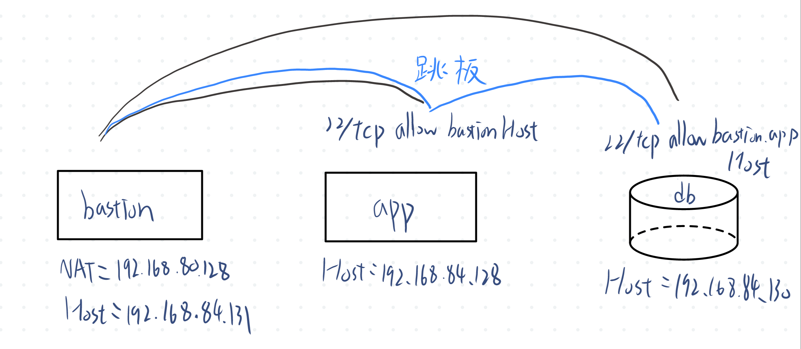

# W03｜多 VM 架構：分層管理與最小暴露設計

## 網路配置

| VM | 角色 | 網卡 | 模式 | IP | 開放埠與來源 |
|---|---|---|---|---|---|
| bastion | 跳板機 | NIC 1 | NAT | 192.168.80.128 | SSH from any |
| bastion | 跳板機 | NIC 2 | Host-only | 192.168.84.131 | — |
| app | 應用層 | NIC 1 | Host-only | 192.168.84.128 | SSH from 192.168.56.0/24 |
| db | 資料層 | NIC 1 | Host-only | 192.168.84.130 | SSH from app + bastion |

## SSH 金鑰認證

- 金鑰類型：ed25519
- 公鑰部署到：app 和 db 的 ~/.ssh/authorized_keys
- 免密碼登入驗證：
  - bastion → app：金鑰認證成功
  - bastion → db：金鑰認證成功

## 防火牆規則

### app 的 ufw status
```
狀態: 啓用
日誌: on (low)
Default: deny (incoming), allow (outgoing), deny (routed)
新建設定檔案: skip

至                          動作          來自
-                          --          --
22/tcp                     ALLOW IN    192.168.84.0/24
```

### db 的 ufw status
```
狀態: 啓用
日誌: on (low)
Default: deny (incoming), allow (outgoing), deny (routed)
新建設定檔案: skip

至                          動作          來自
-                          --          --
22/tcp                     ALLOW IN    192.168.84.128            
22/tcp                     ALLOW IN    192.168.84.131 
```

### 防火牆確實在擋的證據
```
curl: (28) Connection timed out after 5002 milliseconds
```

## ProxyJump 跳板連線
- 指令： ssh -J wdc@192.168.84.128 wdc@192.168.84.130 "hostname"
- 驗證輸出：UbuntuCVT-2
- SCP 傳檔驗證：
```
proxy-test.txt                                                       100%   24    36.1KB/s   00:00    
Test file via ProxyJump
proxy-test.txt                                                       100%   24     9.9KB/s   00:00    
Test file via ProxyJump
```

## 故障場景一：防火牆全封鎖

| 項目 | 故障前 | 故障中 | 回復後 |
|---|---|---|---|
| app ufw status | active + rules | deny all | active + rules |
| bastion ping app | 成功 | 成功 | 成功 |
| bastion SSH app | 成功 | **timed out** | UbuntuCVT |

## 故障場景二：SSH 服務停止

| 項目 | 故障前 | 故障中 | 回復後 |
|---|---|---|---|
| ss -tlnp grep :22 | 有監聽 | 無監聽 | 有監聽 |
| bastion ping app | 成功 | 成功 | 成功 |
| bastion SSH app | 成功 | **refused** | 成功 |

## timeout vs refused 差異
timeout是送出封包之後在時間內沒收到回覆，可以看接收端有沒有開啟port或是被防火牆擋住。refused是送出後有連到，但是被接收端拒絕，可以看需要的port有沒有在監聽

## 網路拓樸圖


## 排錯紀錄
- 症狀：已經關閉了ssh服務但是bastion還能連線到
- 診斷：看app有沒有繼續聽著port22
- 修正：發現是ssh.socket還開著，雖然我已關掉ssh服務，但是當有人要從ssh連線時ssh,socket會去讓ssh服務重啟
- 驗證：停止ssh.socket

## 設計決策
為什麼 app 的 SSH 只允許 Host-only 網段?  
可以擋住其他來源的連線，避免暴露SSH，但是如果之後換了網段等等，就需要更新防火牆規則