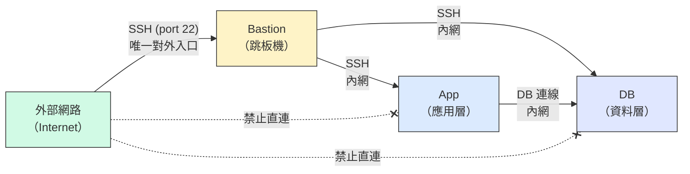
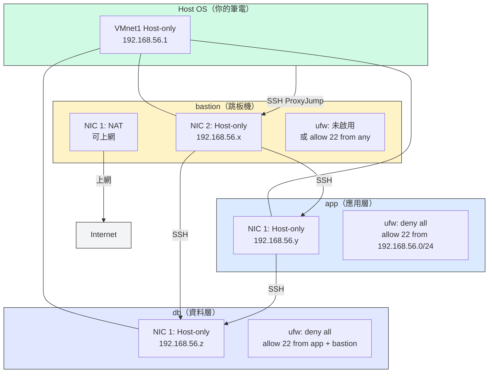
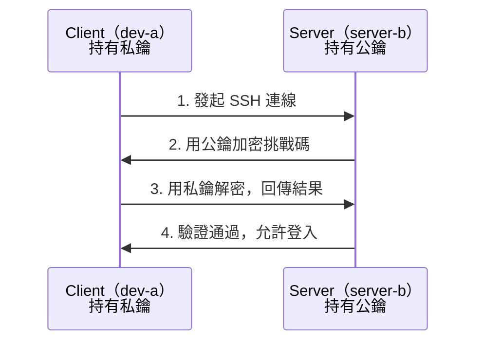
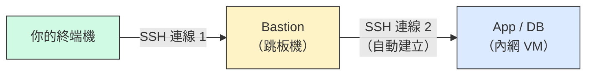

# W03｜多 VM 架構：分層管理、跳板機與最小暴露設計

## 學習目標

1. 搞懂 Bastion → App → DB 分層架構的安全邏輯，講得出「最小暴露」是什麼意思。
2. 知道 SSH 金鑰認證怎麼運作，分得出它跟密碼差在哪。
3. 用 `ufw` 親手設好「先封後開」的防火牆。
4. 用 SSH ProxyJump 跳板連進內網 VM。
5. 搞壞兩次（防火牆封鎖 + SSH 停掉），搞清楚 `timeout` 跟 `refused` 差在哪。

## 先備知識

- 已完成 W02 雙 VM 網路配置，`dev-a` 可 SSH 到 `server-b`。
- 理解 NAT / Host-only 的用途，能用 L2→L3→L4 排錯順序定位問題。
- 能使用 `ip address`、`ping`、`ssh`、`ss` 等基本網路命令。

## 問題情境

W02 的雙 VM 環境裡，所有連線都用密碼認證、沒有防火牆。說白了就是「每台機器都對外開門，歡迎光臨」——教學環境勉強能用，放到真實場景就是在裸奔。

本週要把這個環境升級成分層管理架構：只有跳板機對外，內網機器藏在後面，再用金鑰認證取代密碼。簡單說就是——**門只留一扇，鑰匙只發一把**。

---

## 核心概念

### 一、分層架構的安全邏輯

在真實的伺服器環境中，不同角色的機器有不同的暴露等級：



這個架構分三層：Bastion（跳板機）是唯一對外開放 SSH 的入口，所有管理流量都要先經過它；App（應用層）跑應用服務，只接受內網連線；DB（資料層）存放資料，只接受來自 App 的連線。

這就是**最小暴露原則**（Principle of Least Exposure）——每台機器只開放它角色需要的埠和連線來源，不需要對外就不對外。每多開一個埠、每多一台直接對外的機器，攻擊者可以嘗試的入口（攻擊面）就多一個。想像成你家的門：門越多，你要裝鎖的地方就越多，漏裝一把就完蛋。

如果 App 和 DB 都直接對外開 SSH，任何人都可以暴力破解。把入口集中到 Bastion 一台，你只需要顧好一個點。即使 Bastion 被攻破，App 和 DB 的防火牆還能擋住直接存取，多了一道防線。

> **想一想**：如果 bastion 被攻破了，攻擊者能直接連到 db 嗎？db 的防火牆還擋得住嗎？

#### 實作拓樸圖

搞懂分層邏輯之後，來看本週要蓋的完整架構——包含每台 VM 的 IP 配置、防火牆規則和 SSH 連線路徑：



> 只有 bastion 有 NAT 網卡可上網。app 和 db 只有 Host-only，必須靠 bastion 跳板才能從外部存取。防火牆規則越靠內層越嚴格。

### 二、SSH 金鑰認證 vs 密碼認證

#### 密碼認證的風險

密碼可以被暴力破解（brute-force），攻擊者自動跑數百萬組密碼就可能中獎。密碼也可能被側錄（keylogger）或社交工程騙走，而且很多人會在多處重複用同一組密碼——一處洩漏就全部失守。

#### 金鑰認證的原理

SSH 金鑰認證使用非對稱加密：產生一對金鑰（公鑰 + 私鑰），公鑰放在伺服器端，私鑰留在你的本機。



認證過程中不傳輸密碼，也不傳輸私鑰。即使網路被竊聽，攻擊者也拿不到可以登入的憑證。換句話說，**就算有人在旁邊偷看，也只看到一堆加密過的垃圾**。

#### 金鑰認證的基本流程

用 `ssh-keygen` 在 Client 端產生公鑰和私鑰，再用 `ssh-copy-id` 把公鑰複製到 Server 的 `~/.ssh/authorized_keys`。之後 SSH 連線時就會自動用金鑰認證，不再問密碼。

### 三、防火牆基礎概念

#### ufw（Uncomplicated Firewall）

Ubuntu 預設的防火牆工具，底層是 iptables/nftables，但提供簡單的命令介面。

ufw 的核心邏輯是「先封後開」：先用 `default deny incoming` 擋掉所有進來的連線，再逐條加上你確實需要的埠（例如 `allow 22/tcp`），沒有明確允許的全部被擋。

這比「先開後封」安全得多。先開後封容易漏封某個有漏洞的埠；先封後開的情況下，忘記開的最多是服務不通（你馬上會發現），不會是被偷偷攻擊。**寧可多封一個自己踩到，也不要少封一個被別人鑽進來。**

#### 防火牆規則的範圍控制

除了控制開哪個埠，還可以限制來源。`ufw allow 22/tcp` 對所有來源開放 port 22；`ufw allow from 192.168.56.0/24 to any port 22` 則只允許 Host-only 網段連 port 22。後者更安全——即使埠開著，也只有指定網段的機器能連。

### 四、SSH ProxyJump（跳板連線）

SSH ProxyJump 讓你靠 Bastion 跳板連接內網 VM，不需要把內網 VM 暴露到外網。



指令格式：`ssh -J bastion-user@bastion-ip target-user@target-ip`

這條指令做了兩件事：先 SSH 到 Bastion，再靠 Bastion 建立第二條 SSH 到內網目標。你不需要手動跳——SSH 自動幫你轉，終端機直接就是內網 VM 的 shell。

---

## 操作參考

### Part A：把三台 VM 架起來

#### 步驟 1：準備三台 VM

- 操作：
  - 用 W02 的 `dev-a` 改名為 `bastion`（或新建一台）。
  - 用 W02 的 `server-b` 改名為 `app`（或新建）。
  - 再複製或新建一台 `db`。
- 命令（三台都要做）：

```bash
sudo hostnamectl set-hostname bastion   # 第一台
sudo hostnamectl set-hostname app       # 第二台
sudo hostnamectl set-hostname db        # 第三台

# 各自驗證
hostnamectl
```

#### 步驟 2：設定網路架構

- 操作（VMware GUI）：
  - `bastion`：NIC 1 = NAT、NIC 2 = Host-only。
  - `app`：NIC 1 = Host-only。
  - `db`：NIC 1 = Host-only。
- 驗證（三台都跑）：

```bash
ip address show
ip route show
```

- 預期輸出：`bastion` 有兩張卡（NAT + Host-only），`app` 和 `db` 各一張 Host-only IP，都在同一網段。

#### 步驟 3：確認 bastion 可上網、三台互 ping

- 命令：

```bash
# bastion 上網測試
ping -c 2 google.com          # 在 bastion 上

# 三台互 ping（用 Host-only IP）
ping -c 2 <app-host-only-ip>  # 在 bastion 上
ping -c 2 <db-host-only-ip>   # 在 bastion 上
ping -c 2 <bastion-host-only-ip>  # 在 app 上
ping -c 2 <db-host-only-ip>       # 在 app 上
```

- 預期輸出：bastion 可上網，三台 Host-only 互 ping 全通。

#### 步驟 4：安裝並啟用 SSH 服務

- 命令（三台都跑）：

```bash
sudo apt update  # bastion 可直接跑；app/db 臨時加 NAT 網卡或用 SCP 傳套件
sudo apt -y install openssh-server
sudo systemctl enable ssh
sudo systemctl status ssh --no-pager
ss -tlnp | grep :22
```

- 預期輸出：三台的 port 22 都在監聽。

#### 步驟 5：從 bastion SSH 到 app 和 db

- 命令（在 bastion 上跑）：

```bash
ssh <app-user>@<app-host-only-ip> "hostname && uptime"
ssh <db-user>@<db-host-only-ip> "hostname && uptime"
```

- 預期輸出：分別回傳 `app` 和 `db` 的 hostname。

> **Checkpoint A** — 三節點網路架構就緒：bastion 可上網，三台 Host-only 互 ping，bastion 可 SSH 到 app 和 db。

---

### Part B：設好金鑰，丟掉密碼

#### 步驟 6：在 bastion 上產生 SSH 金鑰對

- 命令（在 bastion 上跑）：

```bash
ssh-keygen -t ed25519 -C "bastion-key"
# 提示 passphrase 時可先按 Enter 跳過（教學用，生產環境建議設定）
```

- 預期輸出：在 `~/.ssh/` 下產生 `id_ed25519`（私鑰）和 `id_ed25519.pub`（公鑰）。
- 驗證：

```bash
ls -la ~/.ssh/
cat ~/.ssh/id_ed25519.pub
```

- 這裡用 `ed25519` 演算法，比 RSA 更短更快。私鑰（`id_ed25519`）**絕對不能外傳**，公鑰（`.pub`）則可以放到任何你想連的伺服器上。

#### 步驟 7：部署公鑰到 app 和 db

- 命令（在 bastion 上跑）：

```bash
ssh-copy-id <app-user>@<app-host-only-ip>
ssh-copy-id <db-user>@<db-host-only-ip>
```

- 預期輸出：提示輸入密碼一次（最後一次需要密碼），然後顯示 key 已新增。
- 驗證（在 bastion 上，這次不該問密碼了）：

```bash
ssh <app-user>@<app-host-only-ip> "echo '金鑰認證成功'"
ssh <db-user>@<db-host-only-ip> "echo '金鑰認證成功'"
```

- 預期輸出：直接登入不問密碼，回傳「金鑰認證成功」。

#### 步驟 8：驗證金鑰已部署

- 命令（在 app 上確認）：

```bash
cat ~/.ssh/authorized_keys
```

- 預期輸出：看到 bastion 的公鑰內容（結尾有 `bastion-key` 標記）。
- SSH daemon 就是靠 `authorized_keys` 這個檔案決定哪些公鑰可以登入。如果這裡沒有你的公鑰，金鑰認證就不會過。

#### 步驟 9：（選做）停用密碼認證

- 這步把密碼登入關掉，之後只能用金鑰認證，暴力破解就沒用了。
- 命令（在 app 上跑）：

```bash
sudo cp /etc/ssh/sshd_config /etc/ssh/sshd_config.bak  # 先備份

# 修改設定
sudo sed -i 's/^#PasswordAuthentication yes/PasswordAuthentication no/' /etc/ssh/sshd_config
sudo sed -i 's/^PasswordAuthentication yes/PasswordAuthentication no/' /etc/ssh/sshd_config

# 重啟 SSH
sudo systemctl restart ssh
```
ssh wdc@192.168.84.128 "hostname"
- 驗證（在 bastion 上）：

```bash
# 金鑰認證應該仍然可用
ssh <app-user>@<app-host-only-ip> "hostname"

# 強制用密碼認證應該被拒
ssh -o PubkeyAuthentication=no wdc@192.168.84.128 2>&1
```

- 預期輸出：金鑰登入成功，密碼登入出現 `Permission denied (publickey)`。
- 注意：做這步之前確認金鑰認證可用，否則會把自己鎖在外面。如果真的鎖住了，可以從 VMware 的 console 直接進 VM 修復。

> **Checkpoint B** — 金鑰認證可用：bastion 免密碼 SSH 到 app 和 db。選做步驟 9 完成時，`ssh -o PubkeyAuthentication=no` 應出現 `Permission denied (publickey)`。

---

### Part C：用 ufw 把門鎖好

#### 步驟 10：在 app 上啟用 ufw 並設定規則

- 命令（在 app 上跑）：

```bash
# 查看目前防火牆狀態
sudo ufw status

# 設定預設規則
sudo ufw default deny incoming
sudo ufw default allow outgoing

# 只允許 Host-only 網段連 SSH
sudo ufw allow from 192.168.84.0/24 to any port 22 proto tcp

# 啟用防火牆
sudo ufw enable

# 確認規則
sudo ufw status verbose
```

- 預期輸出：`Status: active`，規則顯示只有 `192.168.56.0/24` 的 port 22 被允許。
- 注意：`ufw enable` 會提示可能中斷現有 SSH 連線——因為你已經設了 allow 規則，所以不會斷。

#### 步驟 11：在 db 上設定更嚴格的規則

db 只接受來自 app 和 bastion 的 SSH 連線。

- 命令（在 db 上跑）：

```bash
sudo ufw default deny incoming
sudo ufw default allow outgoing

# 只允許 app 的 IP 連 SSH
sudo ufw allow from 192.168.84.128 to any port 22 proto tcp

# 也允許 bastion 的 IP（管理需要）
sudo ufw allow from 192.168.84.131 to any port 22 proto tcp

sudo ufw enable
sudo ufw status verbose
```

#### 步驟 12：驗證防火牆規則生效

- 命令（在 bastion 上跑）：

```bash
# 應該成功
ssh <app-user>@<app-host-only-ip> "echo 'bastion -> app OK'"
ssh <db-user>@<db-host-only-ip> "echo 'bastion -> db OK'"
```

- 命令（在 app 上跑）：

```bash
# 應該成功
ssh <db-user>@<db-host-only-ip> "echo 'app -> db OK'"
```

#### 步驟 13：驗證防火牆確實在擋東西

這步要確認防火牆不只是「開著好看」，而是真的在過濾流量。你得親眼看到它擋下東西才算數。

- 命令（在 app 上跑）：

```bash
# 臨時跑一個簡單的 HTTP server
python3 -m http.server 8080 &
ss -tlnp | grep :8080
```

- 命令（在 bastion 上跑）：

```bash
# 嘗試連 app 的 8080 — 應該被防火牆擋住
curl -m 5 http://192.168.84.130:8080 2>&1
```

- 預期輸出：`curl` timeout 或 connection refused（因為 ufw 只允許 port 22，8080 被擋）。
- 收尾（在 app 上）：

```bash
kill %1   # 停止背景 HTTP server
```

> **Checkpoint C** — 防火牆規則生效：SSH 可通、非允許埠被擋（步驟 13 的 curl 8080 失敗）。

---

### Part D：跳板連線——不開門也能進內網

#### 步驟 14：從 Host 靠 bastion 跳板連到 app

- 這步驗證「Host → bastion → app」的跳板路徑。你的終端機在 Host OS 上，SSH 會先連到 bastion，再自動轉到 app。
- 命令（在 **Host OS 的終端機**上跑，不是在 bastion 內）：
ssh @<app-host-only-ip> "hostname"

```bash
# 一跳：從 Host 連到 bastion
ssh kali@192.168.84.131 "hostname"

# 兩跳：從 Host 靠 bastion 跳到 app（-J 指定跳板）
ssh -J wdc@192.168.84.128 wdc@192.168.84.130 "hostname"
```

- 預期輸出：第一條回傳 `bastion`，第二條回傳 `app`。
- `-J` 後面接跳板機，最後才是你真正要連的目標。你不需要手動跳——終端機直接就是 app 的 shell。

> 如果你的 Host OS 沒有 SSH client（例如舊版 Windows），可以在 bastion 上做這一步，改為 `ssh -J` 從 bastion 靠 app 跳到 db。

#### 步驟 15：設定 SSH config 簡化跳板連線

- 把跳板設定寫進 config，之後 `ssh app` 就會自動走跳板路徑。
- 命令（在 **Host OS** 上跑，或在 bastion 上跑——取決於你常用哪台當起點）：

```bash
mkdir -p ~/.ssh
cat >> ~/.ssh/config << 'EOF'
Host bastion
    HostName <bastion-host-only-ip>
    User <bastion-user>

Host app
    HostName <app-host-only-ip>
    User <app-user>
    ProxyJump bastion

Host db
    HostName <db-host-only-ip>
    User <db-user>
    ProxyJump bastion
EOF

chmod 600 ~/.ssh/config
```

- SSH config 語法簡要說明：
  - `Host`：設定一個別名，之後 `ssh app` 等於 `ssh -J bastion-user@bastion-ip app-user@app-ip`。
  - `HostName`：目標 VM 的實際 IP。
  - `User`：登入帳號。
  - `ProxyJump`：指定經由哪台跳板。SSH 會先連到跳板，再從跳板轉連到目標。
  - `<< 'EOF' ... EOF`：Bash heredoc 語法，將多行文字一次寫入檔案。單引號的 `'EOF'` 代表內容不做變數展開。
- 驗證：

```bash
ssh app "hostname"
ssh db "hostname"
```

- 預期輸出：直接用 `ssh app` 就能連到，不用每次打完整的 `-J` 參數。

#### 步驟 16：用 SCP 靠跳板傳檔

- 命令：

```bash
echo "Test file via ProxyJump" > /tmp/proxy-test.txt

# 如果已設定 SSH config
scp /tmp/proxy-test.txt app:/tmp/
ssh app "cat /tmp/proxy-test.txt"

# 傳到 db（靠 bastion 跳板）
scp /tmp/proxy-test.txt db:/tmp/
ssh db "cat /tmp/proxy-test.txt"
```

- 預期輸出：app 和 db 上都顯示 `Test file via ProxyJump`。

#### 步驟 17：ProxyJump 失敗排錯

- ProxyJump 不通時，逐段切開測試最快找到問題。
- 排錯步驟：

```bash
# 第一步：確認跳板機本身可連
ssh bastion "hostname"
# 如果這步失敗 → 跳板機的 SSH 或網路有問題，先修跳板

# 第二步：確認跳板機可以直連目標
ssh bastion "ssh <app-user>@<app-host-only-ip> hostname"
# 如果這步失敗 → bastion 到 app 的網路或 SSH 有問題

# 第三步：再試 ProxyJump
ssh app "hostname"
```

- 常見問題：
  - `~/.ssh/config` 的縮排必須用空格，`Host` 行頂格、其他設定行縮排。
  - `ProxyJump` 指定的 Host 別名必須在 config 中有對應定義。
  - 如果目標機的防火牆只允許特定來源 IP，確認跳板機的 IP 在允許清單中。

> **Checkpoint D** — ProxyJump 跳板連線可用：從 Host（或 bastion）靠跳板 SSH 到 app 和 db 成功，SCP 傳檔成功。

---

### Part E：故意搞壞防火牆跟 SSH

#### 故障場景一：防火牆全封鎖（Connection timeout）

#### 步驟 18：記錄故障前基線

- 命令（在 bastion 上跑）：

```bash
echo "=== 故障前基線 ==="
ssh app "hostname && sudo ufw status | head -10"
ssh db "hostname && sudo ufw status | head -10"
ssh app "echo 'bastion -> app OK'"
ssh db "echo 'bastion -> db OK'"
```

#### 步驟 19：故障注入 — 在 app 上重設防火牆為全部拒絕

> **⚠️ 必須在 VMware console 操作：** 這個步驟會封鎖所有網路連線（包括 SSH），所以你無法靠 SSH 做。請直接在 VMware 視窗中操作 app 的 console。

- 命令（在 app 的 **VMware console** 上跑）：

```bash
sudo ufw reset
sudo ufw default deny incoming
sudo ufw default deny outgoing   # 連出去也擋
sudo ufw enable
sudo ufw status verbose
```

- 預期輸出：防火牆啟用，所有進出都被封鎖。

#### 步驟 20：從 bastion 觀測故障

- 命令（在 bastion 上跑）：

```bash
echo "=== 故障中（防火牆全封鎖）==="
ping -c 4 192.168.84.128
ssh -o ConnectTimeout=5 wdc@192.168.84.128 "hostname" 2>&1
```

- 預期輸出：SSH 出現 `Connection timed out`（封包被防火牆靜默丟棄）。注意 ping 可能還是通的，因為 ufw 預設不一定擋 ICMP。

#### 步驟 21：在 app 上回復防火牆規則

> **⚠️ 必須在 VMware console 操作：** 因為 SSH 仍然被封鎖，你只能在 VMware console 中回復。

- 命令（在 app 的 **VMware console** 上跑）：

```bash
sudo ufw reset
sudo ufw default deny incoming
sudo ufw default allow outgoing
sudo ufw allow from 192.168.84.0/24 to any port 22 proto tcp
sudo ufw enable
sudo ufw status verbose
```

#### 步驟 22：回復後驗證

- 命令（在 bastion 上跑）：

```bash
echo "=== 回復後 ==="
ssh wdc@192.168.84.128 "hostname && sudo ufw status | head -10"
ssh wdc@192.168.84.130 "hostname"
```

- 預期輸出：與步驟 18 的基線一致。

> **Checkpoint E1** — 防火牆故障注入有三階段證據：故障前/中/後對照完整，故障中出現 `Connection timed out`。

---

#### 故障場景二：SSH 服務停止（Connection refused）

#### 步驟 23：故障注入 — 在 app 上停止 SSH 服務

這次防火牆規則不動，只把 SSH 服務停掉，看看錯誤訊息跟場景一有什麼不同。

- 命令（在 app 上跑，趁 SSH 還通時操作）：

```bash
# 記錄故障前狀態
echo "=== SSH 故障前 ==="
ss -tlnp | grep :22
sudo ufw status | head -5

# 停止 SSH 服務（防火牆維持不變）
sudo systemctl stop ssh

# 確認 SSH 已停
ss -tlnp | grep :22
```

- 預期輸出：停止後 `ss` 看不到 port 22 的監聽。

#### 步驟 24：從 bastion 觀測故障並對比兩種錯誤

- 命令（在 bastion 上跑）：

```bash
echo "=== 故障中（SSH 服務停止）==="

# L3 — 預期成功（網路沒問題）
ping -c 2 192.168.84.128

# L4 — 預期失敗
ssh -o ConnectTimeout=5 wdc@192.168.84.128 "hostname" 2>&1
```

- 預期輸出：ping 成功，但 SSH 出現 `Connection refused`。
- 兩種錯誤的對比：

| 症狀 | 原因 | 排錯層級 |
|------|------|----------|
| `Connection timed out` | 封包被防火牆靜默丟棄（drop） | L3.5（防火牆問題）→ 查 `ufw status` |
| `Connection refused` | 目標埠沒有服務在監聽（RST 回應） | L4（服務問題）→ 查 `ss -tlnp` |

> **想一想**：如果你同時看到 ping 不通又 SSH `Connection refused`，問題比較可能出在哪一層？會不會是兩個問題同時發生？

#### 步驟 25：回復 SSH 服務

- 命令（在 app 上跑——因為 SSH 被停了，需要從 **VMware console** 操作）：

```bash
sudo systemctl start ssh
ss -tlnp | grep :22
```

- 命令（在 bastion 上驗證）：

```bash
echo "=== SSH 回復後 ==="
ssh wdc@192.168.84.128 "hostname"
```

- 預期輸出：SSH 服務回來，連線成功。

> **Checkpoint E2** — SSH 故障注入展示 timeout vs refused 差異：故障中 ping 成功但 SSH 出現 `Connection refused`，能說出兩者指向不同排錯方向。

#### 步驟 26：繪製網路拓樸圖

- 包含以下資訊：
  - 三台 VM 的名稱、角色、網卡模式與 IP
  - 防火牆規則摘要（哪些埠對誰開放）
  - SSH 連線路徑（直連 vs 跳板）
  - 哪些連線被防火牆擋住
- 可參考核心概念中的「實作拓樸圖」，用你的實際 IP 替換。
- 存檔為 `w03/network-diagram.png`（或 `.md`）。

#### 步驟 27：建立交付資料夾與收斂

- 命令：

```bash
mkdir -p ~/virt-container-labs/w03
cd ~/virt-container-labs/w03
```

---

## Checkpoint 總覽

> **Checkpoint A** — 三節點網路架構就緒：bastion 可上網，三台 Host-only 互 ping，bastion 可 SSH 到 app 和 db。

> **Checkpoint B** — 金鑰認證可用：bastion 免密碼 SSH 到 app 和 db。選做步驟 9 完成時，`ssh -o PubkeyAuthentication=no` 應出現 `Permission denied (publickey)`。

> **Checkpoint C** — 防火牆規則生效：SSH 可通、非允許埠被擋（步驟 13 的 curl 8080 失敗）。

> **Checkpoint D** — ProxyJump 跳板連線可用：從 Host（或 bastion）靠跳板 SSH 到 app 和 db 成功，SCP 傳檔成功。

> **Checkpoint E1** — 防火牆故障注入有三階段證據：故障前/中/後對照完整，故障中出現 `Connection timed out`。

> **Checkpoint E2** — SSH 故障注入展示 timeout vs refused 差異：故障中 ping 成功但 SSH 出現 `Connection refused`，能說出兩者指向不同排錯方向。

---

## 交付清單

必交：`w03/README.md` + `w03/network-diagram.png`（或 `.md`）

`README.md` 必須包含：

- 三節點網路配置表（VM 名稱、角色、網卡模式、IP）
- 分層架構與最小暴露原則的說明（用自己的話寫）
- SSH 金鑰認證設定過程與驗證輸出
- 防火牆規則表（每台 VM 的 `ufw status` 輸出）
- 防火牆確實在擋東西的驗證（步驟 13 的 curl 失敗紀錄）
- ProxyJump 跳板連線 + SCP 傳檔驗證
- 故障場景一：防火牆全封鎖的故障前/中/後三階段對照證據（`Connection timed out`）
- 故障場景二：SSH 服務停止的故障前/中/後對照證據（`Connection refused`）
- timeout vs refused 的差異說明（用自己的話寫）
- 至少 1 則排錯紀錄（症狀 → 定位 → 修正 → 驗證）
- 可重跑最小命令鏈：

```bash
ip address show
sudo ufw status
ssh <app-user>@<app-ip> "hostname"
ssh -J bastion <app-user>@<app-ip> "hostname"
```

---

## README 繳交模板

複製到 `~/virt-container-labs/w03/README.md`，補齊各欄位：

```markdown
# W03｜多 VM 架構：分層管理與最小暴露設計

## 網路配置

| VM | 角色 | 網卡 | 模式 | IP | 開放埠與來源 |
|---|---|---|---|---|---|
| bastion | 跳板機 | NIC 1 | NAT | （填入） | SSH from any |
| bastion | 跳板機 | NIC 2 | Host-only | （填入） | — |
| app | 應用層 | NIC 1 | Host-only | （填入） | SSH from 192.168.56.0/24 |
| db | 資料層 | NIC 1 | Host-only | （填入） | SSH from app + bastion |

## SSH 金鑰認證

- 金鑰類型：（例：ed25519）
- 公鑰部署到：（例：app 和 db 的 ~/.ssh/authorized_keys）
- 免密碼登入驗證：
  - bastion → app：（貼上輸出）
  - bastion → db：（貼上輸出）

## 防火牆規則

### app 的 ufw status
（貼上 `sudo ufw status verbose` 輸出）

### db 的 ufw status
（貼上 `sudo ufw status verbose` 輸出）

### 防火牆確實在擋的證據
（貼上步驟 13 的 curl 8080 失敗輸出）

## ProxyJump 跳板連線
- 指令：（貼上你使用的 ssh -J 或 ssh config 設定）
- 驗證輸出：（貼上連線成功的 hostname 輸出）
- SCP 傳檔驗證：（貼上結果）

## 故障場景一：防火牆全封鎖

| 項目 | 故障前 | 故障中 | 回復後 |
|---|---|---|---|
| app ufw status | active + rules | deny all | （填入） |
| bastion ping app | 成功 | （填入） | （填入） |
| bastion SSH app | 成功 | **timed out** | （填入） |

## 故障場景二：SSH 服務停止

| 項目 | 故障前 | 故障中 | 回復後 |
|---|---|---|---|
| ss -tlnp grep :22 | 有監聽 | 無監聽 | （填入） |
| bastion ping app | 成功 | 成功 | （填入） |
| bastion SSH app | 成功 | **refused** | （填入） |

## timeout vs refused 差異
（用自己的話說明兩種錯誤的差異、各自指向什麼排錯方向）

## 網路拓樸圖
（嵌入或連結 network-diagram）

## 排錯紀錄
- 症狀：
- 診斷：（你首先查了什麼？）
- 修正：（做了什麼改動？）
- 驗證：（如何確認修正有效？）

## 設計決策
（說明本週至少 1 個技術選擇與取捨，例如：為什麼 db 允許 bastion 直連而不是只允許從 app 跳？）
```

---

## 常見錯誤與診斷

- 錯誤：`ufw enable` 後 SSH 立刻斷線。
  診斷：啟用前忘了加 `ufw allow 22/tcp`。從 VMware console 登入 VM，加規則或 `ufw disable`。
- 錯誤：金鑰認證設好了但還是問密碼。
  診斷：檢查 `~/.ssh/authorized_keys` 的權限（應為 `600`）和 `~/.ssh` 目錄權限（應為 `700`）。另外確認 `/etc/ssh/sshd_config` 中 `PubkeyAuthentication` 不是 `no`。
- 錯誤：ProxyJump 失敗，跳板機可連但目標機不行。
  診斷：確認 bastion 可以 SSH 到目標機（不靠 ProxyJump 直連測試）。如果直連可以但 ProxyJump 不行，檢查 `~/.ssh/config` 的設定格式。
- 錯誤：三台 VM 的 Host-only IP 不在同一網段。
  診斷：確認三台都連到同一個 VMnet（VMnet1），在 VMware Virtual Network Editor 中檢查。
- 錯誤：app/db 沒網路無法裝 openssh-server。
  診斷：臨時在 VMware 加一張 NAT 網卡，裝完再移除。或從 bastion 用 SCP 傳 `.deb` 套件過去。
- 錯誤：防火牆故障注入後無法從 SSH 回復。
  診斷：防火牆故障注入必須從 VMware console 操作，不要只靠 SSH。

### 排查方向

- 沿用 W02 的 L2→L3→L4 分層排錯，新增 L3.5：防火牆。
  - L2：介面 UP？有 IP？
  - L3：路由正確？ping 到？
  - L3.5：防火牆放行了嗎？（`ufw status`）
  - L4：服務在監聽？（`ss -tlnp`）
- 防火牆問題的典型徵兆：ping 通但服務 timeout（不是 refused）。
  - `Connection refused` → 服務沒跑或埠錯 → L4 問題。
  - `Connection timeout` → 封包被丟棄（drop）→ 防火牆問題。
- 金鑰認證問題三查：權限（`~/.ssh` 700、`authorized_keys` 600）、設定（`sshd_config`）、金鑰匹配（公鑰內容是否正確）。

---

## 做完這週，你學到什麼？

這週你從「所有機器門戶大開」走到「分層管控、只留一個入口」。你親手設了金鑰認證（不再靠密碼這種脆弱的東西）、用 ufw 鎖好防火牆（先封後開，忘記開頂多服務不通，不會被偷打）、靠 ProxyJump 從外面跳進內網。最後你還故意搞壞了兩次，親眼看到 `timeout` 跟 `refused` 長得不一樣、指向不同的問題。

這套「最小暴露 + 分層防禦」的思路不只是這門課的作業——以後不管你管幾台機器、上不上雲，安全架構的核心邏輯都是這一套。

---

### 延伸閱讀

- `[R1]` VMware Workstation Pro 17 官方使用手冊：網路模式與虛擬交換器設定。（[來源連結](https://techdocs2-prod.adobecqms.net/content/dam/broadcom/techdocs/us/en/pdf/vmware/desktop-hypervisors/workstation/vmware-workstation-pro-17-0.pdf)）
- `[R2]` Ubuntu OpenSSH Server 指南：sshd 安裝、金鑰認證設定、安全強化。（[來源連結](https://documentation.ubuntu.com/server/how-to/security/openssh-server/)）
- `[R3]` `ssh(1)` man page：SSH 連線、ProxyJump、config 檔案。（[來源連結](https://man.openbsd.org/ssh)）
- `[R4]` `ssh-keygen(1)` man page：金鑰對產生與管理。（[來源連結](https://man.openbsd.org/ssh-keygen)）
- `[R5]` `ssh_config(5)` man page：SSH client 設定檔格式與 ProxyJump。（[來源連結](https://man.openbsd.org/ssh_config)）
- `[R6]` Ubuntu UFW 指南：防火牆設定、規則管理、除錯。（[來源連結](https://documentation.ubuntu.com/server/how-to/security/firewalls/)）
- `[R7]` NIST SP 800-123 Guide to General Server Security：最小暴露原則與伺服器安全架構。（[來源連結](https://csrc.nist.gov/pubs/sp/800/123/final)）
- `[R8]` `ufw(8)` man page：UFW 命令語法與規則管理。（[來源連結](https://manpages.ubuntu.com/manpages/noble/en/man8/ufw.8.html)）
